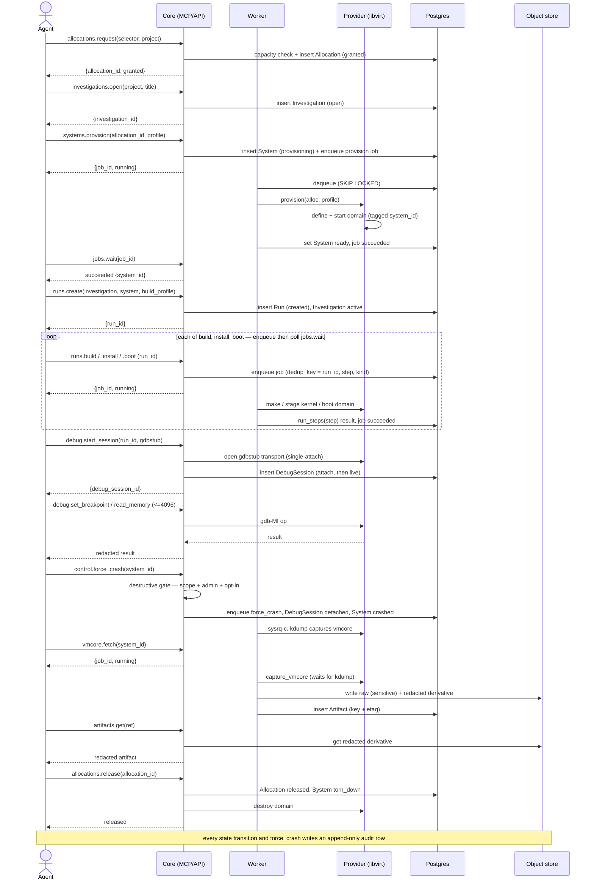
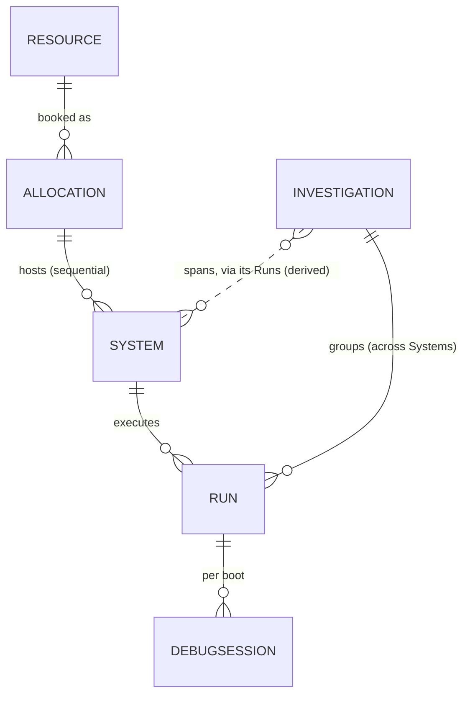

# M0 — Walking Skeleton (Integration Contract)

## Purpose

M0 proves the new architecture end-to-end on one resource kind — local
libvirt/QEMU ([0004](../adr/0004-first-slice-local-libvirt.md)) — by driving the
thinnest real path through all nine planes. This document is the **integration
contract**: it pins the seams (schema, object lifecycles, tool I/O shapes, plane
interfaces) that every M0 sub-project plan implements against. It does not
re-argue the decisions — those live in the [ADRs](../adr/) — and it defers
implementation detail to the per-sub-project plans listed under "Decomposition" in
[`top-level-design.md`](top-level-design.md).

### The walking-skeleton path

The acceptance spine. Every step is a real operation against a real libvirt host:

```
resources.list                         → pick the local libvirt Resource
allocations.request(selector, project) → granted (always-yes, capacity-checked)
investigations.open(project, title)    → investigation_id
systems.provision(allocation, profile) → job → system_id (defined → ready)
runs.create(investigation, system, build_profile) → run_id
runs.build(run_id)                     → job (kernel from source)
runs.install(run_id)                   → job (kernel onto the System)
runs.boot(run_id)                      → job (boot the installed kernel)
debug.start_session(run_id, gdbstub)   → debug_session_id (attach → live)
debug.set_breakpoint / .read_memory    → fast, synchronous
control.force_crash(system_id)         → destructive (gated); ends the boot:
                                         DebugSession live → detached, System → crashed
vmcore.fetch(system_id)                → job (waits for kdump capture) → vmcore ref
artifacts.get(ref)                     → redacted artifact
allocations.release(allocation_id)     → released (System torn down)
```

Each long-running step returns a `{job_id, status}` handle polled via `jobs.wait`
([0008](../adr/0008-async-worker-tier-job-queue.md)). The path runs under a single
`(principal, agent_session, project)` and every transition writes an audit row.

The same path as a sequence, showing the tier that owns each step and the
enqueue → worker → poll spine for long-running operations:



## Non-goals (deferred to M1+)

M0 is a skeleton, not a product. Explicitly out of scope:

- **No remote/cloud/bare-metal providers** — one provider only (M2+).
- **No real reservation, chargeback, or cost model** — allocation is "always-yes,"
  capacity-admitted against a per-host concurrent-Allocation cap (configured per
  host; in M0 one Allocation → one System, so it bounds Systems too); the cost
  model ([0007](../adr/0007-metering-budgets-admission.md)) is M1.
- **No budget/quota enforcement** — admission checks capacity, not spend (M1).
- **No fault injection** — the M1.5 mock provider stresses the seams M0 leaves
  slack (lease expiry mid-job, worker death, transport drop, forced secret
  resolution).
- **No hard per-tenant sandboxing** — designed-for, deferred ([0008](../adr/0008-async-worker-tier-job-queue.md)).
- **No System reprovision-in-place** — M0 provisions once and tears down; the
  `reprovisioning` transition is M1.

## Domain objects in M0

The six durable objects ([0003](../adr/0003-six-durable-objects.md)) all exist in
M0, with reduced state machines. `→` is a transition; terminal states are bold.

| Object | M0 state machine | M0 admission / notes |
|--------|------------------|----------------------|
| Resource | `available` / `degraded` / `offline` | one row: the local libvirt host, registered at startup |
| Allocation | `requested → granted → active → releasing → `**`released`** (+ **`failed`**) | always-yes, capacity-checked against a per-host concurrent-Allocation cap; no budget |
| System | `defined → provisioning → `**`ready`** ` → `crashed` ` → `**`torn_down`** (+ **`failed`**) | one System per Allocation in M0 (no reprovision); `force_crash` drives `ready → crashed`; vmcore is captured from `crashed` |
| Investigation | `open → active → `**`closed`** (+ **`abandoned`** by reconciler) | becomes `active` on first Run |
| Run | `created → running → `**`succeeded`** ` / `**`failed`** ` / `**`canceled`** | one build per Run; idempotent steps keyed `(run_id, step)`; a failed step is terminal for the Run — recovery is a **new** Run on the same System (see "Failure & retry") |
| DebugSession | `attach ↔ live ↔ detached` (**ends at reboot/crash**) | one boot = one session; durable row, heartbeated; `force_crash` (or panic) drives `live → detached` |

`run.system → allocation` is the binding invariant: a Run's Allocation is fixed by
its System ([0003](../adr/0003-six-durable-objects.md)). The Investigation
grouping imposes no allocation constraint.



The model has **two independent hierarchies that meet at Run**: the provisioning
chain `Resource → Allocation → System`, and the **Investigation** campaign. An
Investigation is *not* below System — it is a project-scoped **root** that groups
the Runs iterating toward a goal — a bug fix or a feature, optionally linked to
external trackers (Bugzilla/JIRA) via mutable `external_refs`; and because each Run
executes on exactly one
System, an Investigation **spans every System (and Allocation, and resource kind)
its Runs touched** — the local-VM-to-bare-metal chase from the top-level design.
That span is the dashed `INVESTIGATION ⋯ SYSTEM` edge above: it is *derived through
Run*, with no `investigation_system` table.

A Run is therefore the **join point**: exactly one System (which fixes its
Allocation) and exactly one Investigation. Within the provisioning chain, lower
layers outlive higher ones — a Resource outlives its Allocations, which outlive
their Systems, which outlive their Runs — but an Investigation's lifetime is
**independent** and may outlive any single System or Allocation. In M0 the
`ALLOCATION → SYSTEM` and `RUN → DEBUGSESSION` relationships are 1:1 (no
reprovision; one boot per Run).

These are the **six durable objects** in full — `project` (and `principal`) are
deliberately **not** entities here: they are an identity/RBAC scope, not a domain
object. `project` lives as a column on rows and in the
`(principal, agent_session, project)` attribution tuple, with per-project budgets
([0007](../adr/0007-metering-budgets-admission.md)) and project-scoped roles
([0006](../adr/0006-oidc-rbac-attribution.md)); there is no `projects` table in the
core domain. So Investigation appears as a root grouping rather than a seventh
entity.

## Postgres schema (M0 subset)

System-of-record per [0005](../adr/0005-postgres-object-store-state.md). Key
columns only; every object table carries `id` (uuid), `state`, `created_at`,
`updated_at`, and `(principal, agent_session, project)` attribution.

```
resources(id, kind='local-libvirt', capabilities jsonb, pool, cost_class,
          status, host_uri)
allocations(id, resource_id→resources, project, state, lease_expiry,
            principal, agent_session, capability_scope jsonb)
systems(id, allocation_id→allocations, state, provisioning_profile jsonb,
        target_fingerprint, domain_name)            -- domain_name = libvirt domain
investigations(id, project, title, external_refs jsonb, state, last_run_at)
                                                        -- external_refs: mutable [{tracker, id, url}] (bugzilla/jira)
runs(id, investigation_id→investigations, system_id→systems, state,
     build_profile jsonb, kernel_ref, debuginfo_ref, failure_category)
                                       -- debuginfo_ref: vmlinux/DWARF artifact for vmcore symbolization
run_steps(run_id→runs, step, state, result jsonb,
          UNIQUE(run_id, step))                     -- idempotency ledger
debug_sessions(id, run_id→runs, state, transport, transport_handle,
               worker_heartbeat_at)
jobs(id, kind, payload jsonb, state, attempt, max_attempts, worker_id,
     lease_expires_at, heartbeat_at, result_ref, error_category,
     authorizing jsonb,                             -- (principal, agent_session, project, scope)
     dedup_key NOT NULL, UNIQUE(dedup_key))         -- admission idempotency, e.g. (run_id, step, kind)
artifacts(id, owner_kind, owner_id, object_key, etag, sensitivity,
          retention_class)
audit_log(id, ts, principal, agent_session, project, tool, object_kind,
          object_id, transition, args_digest)       -- append-only
```

**Concurrency** ([0005](../adr/0005-postgres-object-store-state.md)):
transaction-scoped advisory locks (`pg_advisory_xact_lock`) serialize
per-Allocation and per-System operations; a per-project lock guards the
capacity-admission check. Idempotent step execution is enforced by the
`run_steps(run_id, step)` unique key — a retried step reads its prior `result`
instead of re-running.

## Job queue & worker tier

Per [0008](../adr/0008-async-worker-tier-job-queue.md). The `jobs` table *is* the
queue; workers dequeue with `SELECT … FOR UPDATE SKIP LOCKED`.

- **M0 job kinds:** `provision`, `build`, `install`, `boot`, `capture_vmcore`.
  Everything else (breakpoints, reads, power state) is synchronous.
- **Lease:** a worker claims a job, sets `worker_id` + `lease_expires_at`, and
  heartbeats. A lapsed lease returns the job for a remaining attempt; exceeding
  `max_attempts` (or a non-idempotent op that crashed mid-effect) dead-letters to
  `failed` and runs the op's compensation
  ([0009](../adr/0009-capability-provider-dispatch.md)).
- **Admission idempotency:** a long-running tool is idempotent at admission — it
  computes a `dedup_key` (run-scoped jobs use `(run_id, step, kind)`); re-issuing
  the tool returns the **existing** job handle instead of enqueuing a duplicate.
  The `(run_id, step)` ledger then guards step *execution* beneath it, so neither
  a client retry nor a worker retry double-applies an effect.
- **Pools:** scoped per resource class. M0 has one pool (local-libvirt); the
  per-pool, per-tenant fairness rule is wired but trivially satisfied with one
  tenant.
- **Authorization:** each job row records its authorizing
  `(principal, agent_session, project, scope)` at admission; the worker runs under
  a service-scoped internal grant ([0002](../adr/0002-multi-user-mcp-http.md)),
  performing no fresh authorization.

## Failure & retry

A step failure is terminal for its Run ([0003](../adr/0003-six-durable-objects.md):
one build per Run). The Run moves to `failed` carrying the step's `error_category`;
the agent recovers by creating a **new** Run on the **same** System — allocation
and provisioning are not repeated. Three failure shapes are distinguished so audit
and SLO tracking can tell them apart:

- **Step `failed`** — build/install/boot returned a deterministic error; the new
  Run is the retry unit.
- **Job abandoned** — `lease_expired` or worker death; the job's bounded retries
  ([0008](../adr/0008-async-worker-tier-job-queue.md)) apply first, and only past
  `max_attempts` does the Run go `failed` (`lease_expired`).
- **`jobs.cancel`** — an explicit agent abort; the Run is `canceled` and the op's
  cleanup contract ([0009](../adr/0009-capability-provider-dispatch.md)) runs.

## Object-store layout

Per [0013](../adr/0013-object-store-layout-retention.md). S3-compatible, keyed
`{tenant}/{object_kind}/{object_id}/{artifact}`.

- **M0 object kinds:** `vmcore`, `build-output`, `transcript` (gdb/console).
- **Sensitivity:** raw capture is `sensitive`; only a `redacted` derivative is
  response-eligible. `artifacts.get` on a `sensitive` object requires the artifact
  scope and returns the redacted derivative.
- **Write ordering:** the object is written before its `artifacts` row commits; the
  reconciler GCs objects with no committed referrer. A missing object on fetch
  surfaces `stale_handle`.
- **Isolation:** enforced by bucket policy / scoped credentials, not the prefix.

## MCP tool surface (M0 subset)

FastMCP over streamable HTTP ([0010](../adr/0010-fastmcp-framework-auth.md)).
Every tool returns structured JSON with the object id, `status`,
`suggested_next_actions`, and artifact **references** — never log dumps. Async
tools return a job handle.

```
Discovery   resources.list(filter?) → [{resource_id, kind, capabilities, status}]
            resources.describe(resource_id) → {…, cost_class, health}
Allocation  allocations.request({selector, project}) → {allocation_id, status:"granted"|"denied", reason?}
            allocations.get(allocation_id) / .release(allocation_id) / .list(project?)
Provision   systems.provision(allocation_id, provisioning_profile) → {job_id, status:"running"}
            systems.get(system_id) / .teardown(system_id) → {job_id}
Investigate investigations.open(project, title, external_refs?) → {investigation_id}
            # external_refs: [{tracker, id, url}] — e.g. bugzilla, jira; mutable
            investigations.get / .close / .link / .unlink(investigation_id, ref)
Run         runs.create(investigation_id, system_id, build_profile) → {run_id}
            runs.build(run_id) → {job_id}   runs.install(run_id) → {job_id}
            runs.boot(run_id)  → {job_id}   runs.get(run_id)
Debug       debug.start_session(run_id, transport:"gdbstub") → {debug_session_id}
            debug.set_breakpoint(session_id, {addr|symbol}) → {breakpoint_id}
            debug.read_memory(session_id, addr, length≤4096) → {bytes_b64}
            debug.read_registers(session_id) → {registers}
            debug.continue / .interrupt(session_id)
            debug.end_session(session_id)
Control     control.force_crash(system_id) → {job_id}        # destructive → gated
            control.power(system_id, on|off|cycle|reset) → {job_id}   # destructive → gated
Retrieve    vmcore.list(system_id) → [{artifact_ref}]
            vmcore.fetch(system_id) → {job_id}   # → vmcore artifact
            artifacts.list(run_id|system_id) / .get(artifact_ref)
Jobs        jobs.get(job_id) / .wait(job_id, timeout) / .cancel(job_id) / .list(filter?)
```

`jobs.get` returns `{job_id, kind, status:"running"|"succeeded"|"failed"|"canceled",
result_ref?, error_category?}`. A failed job carries an `error_category` from the
taxonomy below.

## Plane interfaces

The active M0/M1 provider seam is typed `ProviderRuntime` ports
([0063](../adr/0063-typed-provider-runtime.md), refined by
[0066](../adr/0066-remove-capability-registry-prototype-from-src.md)). Startup constructs
the concrete local-libvirt ports once in `providers.composition`; MCP tools and worker
handlers receive those typed ports directly. Capability-registry dispatch from ADR-0009 and
ADR-0022 is historical design context for a future multi-provider milestone, not runtime
infrastructure in this implementation.

See [top-level design](top-level-design.md) for the current extension path. A new provider
adds concrete port implementations and `ProviderRuntime` wiring; reintroducing capability
matching requires a new ADR.

```python
@dataclass(frozen=True)
class ProviderRuntime:
    discovery: DiscoveryPort
    provisioner: Provisioner
    builder: Builder
    controller: Controller
    retriever: Retriever

    def install_boot(self) -> tuple[Installer, Booter]: ...
```

The `AllocationPlane` in M0 is the always-yes capacity-checked path implemented in
core, not the provider (a provider-supplied lease arrives at M1).

## Local-libvirt provider (M0)

How each plane is realized against libvirt/QEMU:

| Plane | M0 implementation |
|-------|-------------------|
| Discovery | enumerate the local libvirt host; advertise arch/cpu/memory + `gdbstub` transport |
| Provisioning | create the `systems` row (`provisioning`) first, then render libvirt domain XML from the profile ([0011](../adr/0011-provisioning-profile-schema.md)) + a rootfs image and define/start the domain **tagged with its `system_id`** (libvirt metadata) |
| Build | local `make` from the kernel source ref in the build profile |
| Install | direct-kernel boot — stage the built kernel/initrd for the domain's next boot, **with a `crashkernel=` reservation** so kdump can capture (see kdump prerequisite below) |
| Connect | QEMU `gdbstub` transport (single-attach — a second attach is `transport_conflict`) |
| Debug | gdb-MI tier (ported) over the gdbstub; drgn for introspection |
| Control | `virsh` destroy/reset; `force_crash` via `sysrq-c` (or QEMU monitor) |
| Retrieve | vmcore via the kdump path; fetch into the object store |

**kdump prerequisite.** The crash→vmcore endpoint only produces a core if the guest
boots with a `crashkernel=` memory reservation and a kdump capture service/initramfs
present. The M0 provisioning profile ([0011](../adr/0011-provisioning-profile-schema.md))
and the booted kernel config must guarantee both. If `force_crash` yields no core
within the capture window, `vmcore.fetch` returns a typed `readiness_failure` (not an
empty artifact).

## Auth, RBAC & attribution (M0)

Per [0002](../adr/0002-multi-user-mcp-http.md), [0006](../adr/0006-oidc-rbac-attribution.md),
[0010](../adr/0010-fastmcp-framework-auth.md).

- **Authn:** FastMCP `JWTVerifier` validates signature, `iss`, `aud`, expiry
  against the IdP JWKS; `principal` = token subject.
- **Attribution:** M0 is single-operator/local and **may run `principal`-only**
  (the milestone-gated allowance in 0002); if the IdP mints a signed
  `agent_session`, it is carried. Either way attribution is recorded, never
  inferred from request data.
- **RBAC:** the `viewer`/`operator`/`admin` roles exist; M0's operator holds
  `admin` for the project. The **destructive-op gate is fully enforced even in
  M0**: `force_crash`, `control.power(off|cycle|reset)`, and `teardown` require
  (a) the allocation capability scope, (b) `admin` role, (c) explicit profile
  opt-in — all three.

## Cross-cutting in M0

- **Redaction** — all guest output, gdb/SoL transcripts, and console logs pass
  through the ported redactor before persistence and before any response snippet.
  Raw artifacts stay `sensitive` in the object store.
- **Secrets by reference** ([0012](../adr/0012-secret-backend.md)) — the file-ref
  backend resolves references within an allowlisted secrets root; on resolution
  the value is registered into `PROCESS_SECRET_REGISTRY` before use, and
  pre-registration output is quarantined. M0's local path uses few secrets, but
  the registration contract is exercised (the M1.5 mock forces it harder).
- **Audit** — every state transition and destructive op writes an append-only
  `audit_log` row attributing `(principal, agent_session, tool, args_digest)`.

## Reconciler (M0 subset)

A periodic core loop repairs drift between Postgres and libvirt. M0 handles:

- **Orphaned System** — a System whose Allocation is `released`/`failed` is torn
  down (a System never outlives its Allocation).
- **Abandoned job** — a job whose lease lapsed is requeued or, past
  `max_attempts`, dead-lettered to `failed` with compensation run.
- **Dead DebugSession** — a `live` session whose transport/heartbeat is unreachable
  is moved to `detached`.
- **Leaked libvirt domain** — via the provider `list_owned` surface; domains carry
  their `system_id` as libvirt metadata. A domain is reaped only when its tagged
  `system_id` has no row (or a `torn_down` row) **and** no provision/teardown job
  for it is in-flight, and never within the provision grace window — so a domain
  mid-create is not mistaken for a leak (the write-ordering counterpart to the
  object-store GC rule above).

**Lease-expiry policy:** on `lease_expiry`, in-flight jobs drain within a grace
window then are force-killed; the owning Run becomes `failed` (`lease_expired`),
distinct from a `canceled` Run. Deeper reconciliation (idle-Investigation sweep,
mid-job secret-resolution failure) is exercised first under M1.5.

## Error taxonomy (M0)

Reuse the PoC's stable `ErrorCategory` ([0001](../adr/0001-greenfield-rewrite.md)).
M0 can emit: `configuration_error`, `missing_dependency`, `build_failure`,
`boot_timeout`, `readiness_failure`, `debug_attach_failure`,
`infrastructure_failure`, `stale_handle`, `transport_conflict`, `not_implemented`,
and the new distributed categories `allocation_denied`, `lease_expired`,
`provisioning_failure`, `install_failure`, `transport_failure`, `control_failure`.
Pick the most specific; do not invent strings.

## Ported PoC modules

Each salvaged module lands behind a plane interface or a cross-cutting service:

| Module (PoC) | M0 home |
|--------------|---------|
| `safety/redaction.py`, `safety/secret_registry.py` | cross-cutting redaction + [0012](../adr/0012-secret-backend.md) |
| `safety/paths.py` | path-safety for the file-ref secret backend + artifact keys |
| gdb-MI tier | Debug plane (local-libvirt) |
| drgn introspect / vmcore | Debug plane + Retrieve (`introspect.*`, postmortem) |
| crash postmortem | Retrieve / postmortem |
| run-readiness preflight | Run lifecycle (pre-`boot` readiness) |
| `ErrorCategory` taxonomy (`domain.py`) | shared error model |
| 4096-byte `read_memory` cap | Debug plane invariant |

## Exit criteria

M0 is done when the walking-skeleton path runs green end-to-end, demonstrably:

1. **Path completes** — every step from `allocations.request` through
   `vmcore.fetch` succeeds against a real libvirt host, producing a fetchable,
   redacted vmcore artifact.
2. **Attribution** — every transition and the `force_crash` write an `audit_log`
   row with the request's `(principal, agent_session?, project)`.
3. **Redaction** — a known secret value present in console/gdb output is masked in
   the persisted transcript and in every response snippet; the raw object is
   `sensitive` and reachable only via `artifacts.get`.
4. **Idempotency** — replaying a completed `runs.build`/`install`/`boot` step
   returns the prior result without re-executing (verified by re-issuing after a
   simulated client retry).
5. **Teardown** — `allocations.release` tears down the System; the reconciler
   leaves no orphaned libvirt domain (`list_owned` is empty of unowned domains).
6. **Destructive gate** — `force_crash` is refused when any of the three checks
   (capability scope, `admin` role, profile opt-in) is absent.

These six are the falsifiable signal that the model and the seams hold for one
provider — the precondition for adding the M1.5 fault-injection provider and,
after it, M2 remote libvirt.
